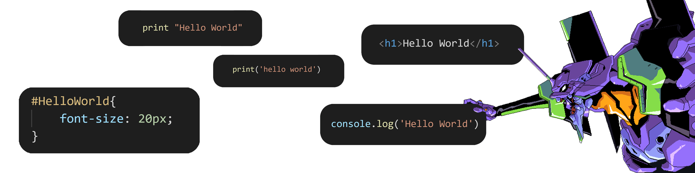

  
### Hi, **I'm Francesco**, I'm a 20 years old italian **Web Developer**, I got into coding back in 2019 with basic javascript projects and then built up my experiences. I stepped outside my comfort zone in late 2020 learning new languages and I'm always trying to improve and learn as much as possible.
   
<h2 style= "font-size: 40px"> skills: </h2>
<ul>
<li> 📱 HTML, CSS, JS</li>
<li> 🐍 Python</li>
<li> 💎 Ruby on Rails (still very new tho)</li>
<li> ⚛️ bootstrap</li>
<li> ✌️ VueJS</li>
<li> ☁️ PHP</li>
<li> 🧩 laravel</li>     

</ul>

      

## If you want to check out **my projects** you can start from here:
 
 

  
## you can **find me here**:   
 
 

